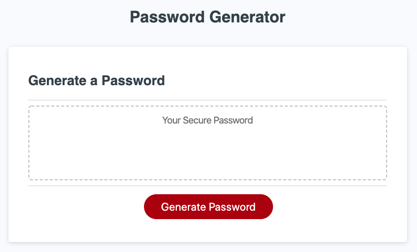

# Saul's Password Generator

## Purpose
A password generator used to randomly generate a password that meets certain criteria requested such as a password min and max length, and character types such as lowercase, upper case, numeric, and/or special characters. A password will be generated based on the users's required password criteria selected in the password generator prompts.

## Built with
* starter HTML
* starter CSS

## Link to webpage
https://saul10huerta.github.io/password-generator/

### Contribution
Made by Saul Huerta